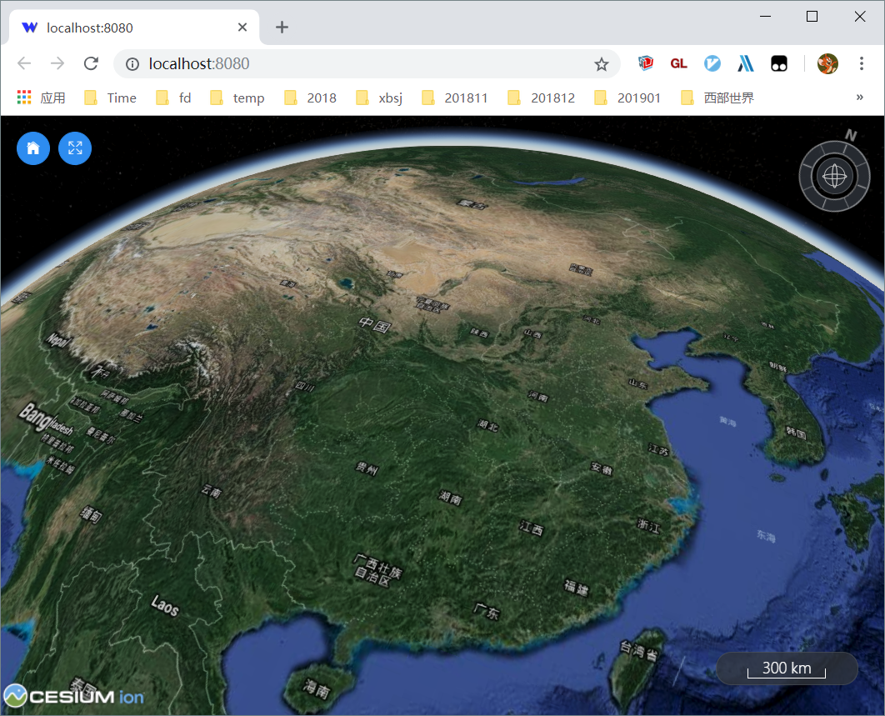
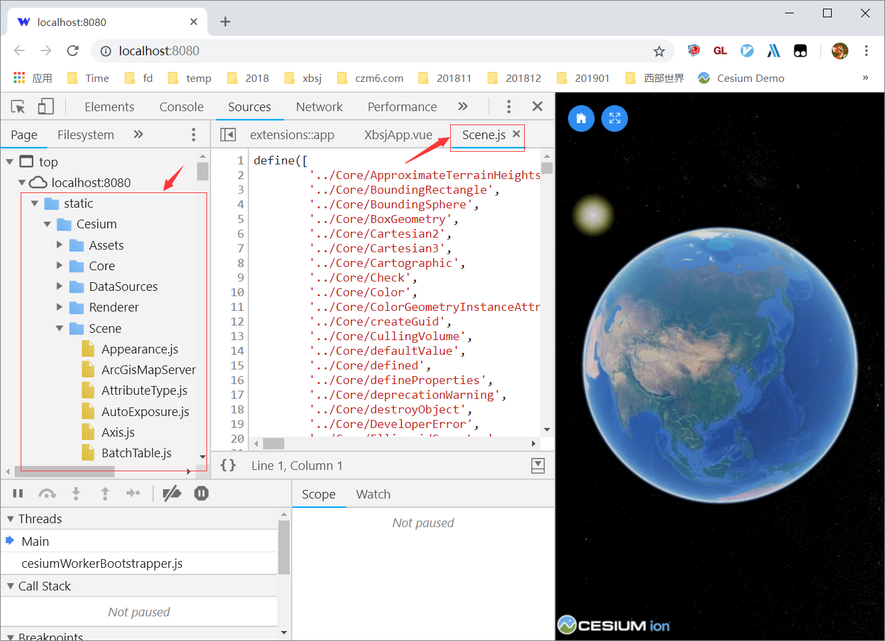
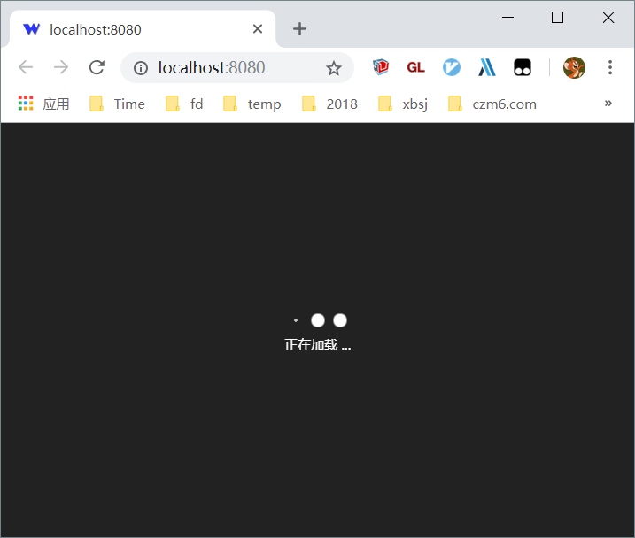
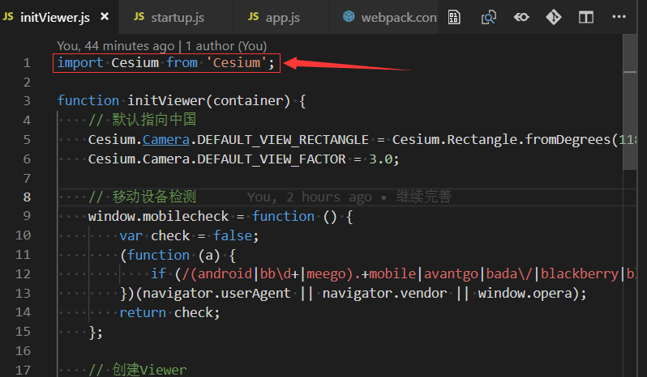
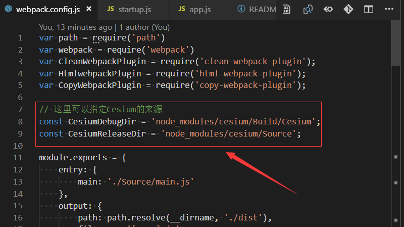

# Cesium+Vue+Webpack框架

vtxf 20190108

## 前言

[预览页面](https://cesiumlab.github.io/cesium-vue-webpack/)  

之前使用Vue时，老是遇到webpack的一些配置问题。比如调试起来不方便、编译速度缓慢、服务器的目录结构总是不对等问题。经过多次填坑，终于摸索一套使用相对方便的框架出来。在这里和大家分享一下。

如果您也希望使用目前流行的vue来管理Cesium所在的三维窗口，不妨一试，希望能对您有所帮助！如果使用中遇到问题，欢迎提issue。



## 特色

### 1 可以直接调试Cesium源码 

npm run dev时，可以直接调试Cesium源码，此源码非编译后unminifiedXXX文件夹下的代码，而是真正的Source目录下的源码。这样会非常方便调试代码使用中的问题。



### 2 避免首页初次加载的迟滞现象

Cesium.js文件较大，会导致初次加载整个网页时速度严重滞后。本项目使用异步方式加载Cesium，Cesium.js未载入之前，页面会显示```正在加载```的提示。



### 3 引入时可以直接用'Cesium'

Cesium官方给出的webpack示例时使用的是'Cesium/Cesium'。这不太符合常规的第三方库的引入方式，也让调试带来不便。这里摒弃'Cesium/Cesium'的用法，可以直接使用```require('Cesium')```或者```import Cesium from 'Cesium'```的方式来引入Cesium。



### 4 不破坏相对目录结构

webpack编译后的文件可以放在http服务器的任意目录，这样不用担心不确定放置在服务器上的具体位置而老是重新修改webpack配置文件，再重新编译。

### 5 Cesium.js作为外部文件引入

不会因为要引入Cesium，需要不断重新编译整个Cesium，拖慢整个编译速度，从而影响调试和开发。

### 6 Vue中可引入Cesium对象，而不影响性能

提供了一种在Vue.data中引入Cesium对象，而不影响性能的方式。基本思路是Object.freezed所有Cesium类对象。

### 7 Cesium目录位置可任意指定

可以使用npm install以后的Cesium，也可以直接使用自己下载编译甚至自行修改以后的Cesium。好处是可以随时切换Cesium的不同版本，方便比较调试。



## 使用方法

1. 下载源码 git clone xxx
2. 根目录下执行命令 npm install
3. 调试时，使用 npm run dev，会直接启动浏览器看到三维地球页面。
4. 编译时，请使用 npm run build, 生成的文件在 dist目录下。

## 说明

CesiumLab.com 提供。